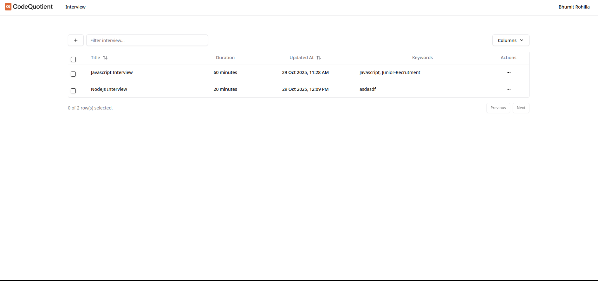
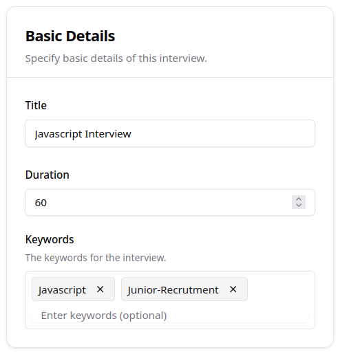
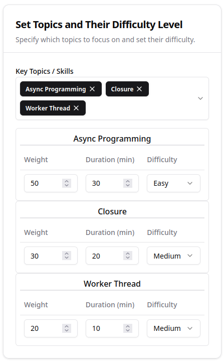
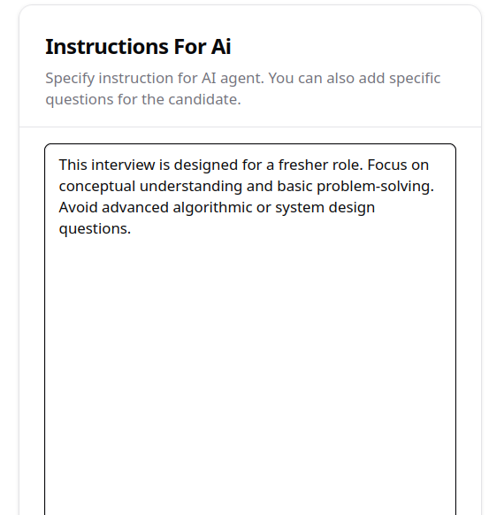
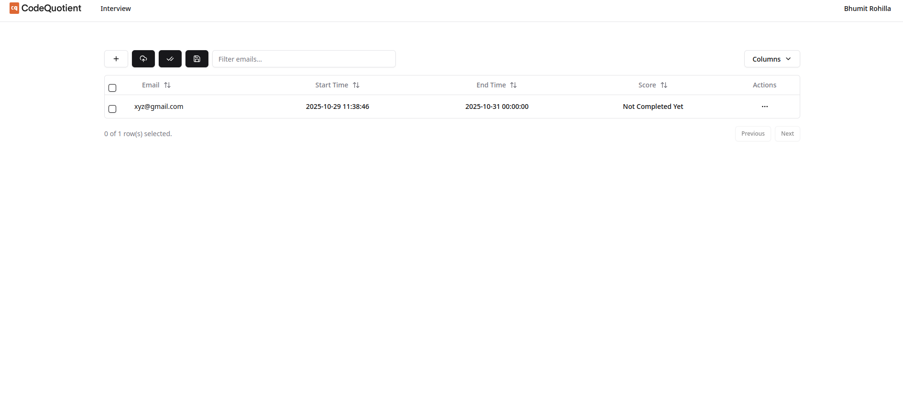
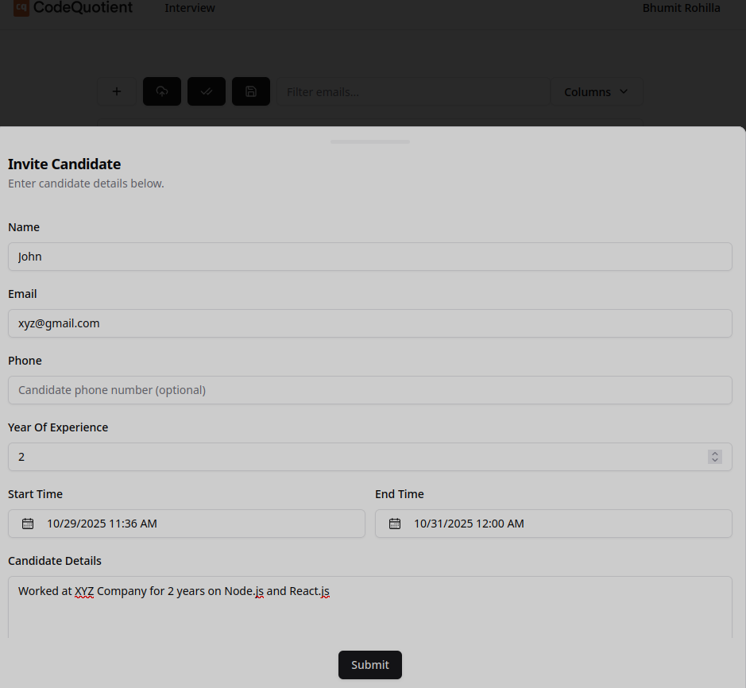
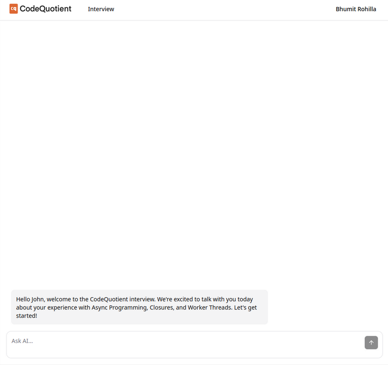
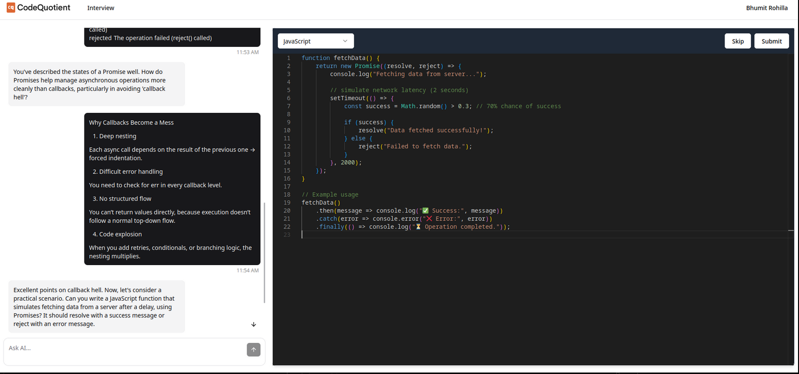

# Project Flow

This project enables recruiters to create, schedule, and evaluate AI-driven interviews.
This document explains the full end-to-end flow for both **Recruiters** and **Candidates**, with detailed configuration, validation rules, and screenshots to help contributors and users understand the system.

---

## Table of Contents

1. [Recruiter Flow](#1-recruiter-authentication--dashboard)

   * [Interview List Page](#2-interview-list-page)
   * [Creating a New Interview](#3-creating-a-new-interview)
   * [Candidate Management Page](#4-candidate-management-page)
   * [Inviting a Candidate](#inviting-a-candidate)

2. [Candidate Flow](#5-candidate-interview-flow)

   * [Welcome Screen](#welcome-screen)
   * [Interactive Interview Interface](#interactive-interview-interface)
   * [Code Editor Example](#code-editor-example)

3. [Evaluation & Result Management](#6-evaluation--result-management)

4. [Security & Validation](#7-security--validation)

5. [Screens Reference Summary](#screens-reference-summary)

6. [Summary](#summary)

7. [Contributing](#contributing)

---

## 1. Recruiter Authentication & Dashboard

After logging in (via **Email/Password**, **Google**, or **GitHub**), users are treated as **Recruiters** by default.

From the dashboard, recruiters can:

* View all existing interviews
* Create new interviews
* Edit or clone interviews
* Manage invited candidates
* Monitor ongoing and completed interviews

---

## 2. Interview List Page



After login, recruiters land on the **Interview List Page**, where they can view all existing interviews.

Each interview displays:

* Title
* Duration
* Created On date
* Tags / Keywords

#### Actions Menu

From the **⋯ Actions** menu, recruiters can:

* **Edit** – Modify interview details
* **Clone** – Duplicate an interview
* **Open Candidates** – Manage invites and view results


This page serves as the entry point for interview management.
Clicking **Add (+)** on this page opens the **Create Interview** flow.

---

## 3. Creating a New Interview

Recruiters can create a new interview by clicking the **Add (+)** button on the dashboard or interview list page.

This section describes in detail how to configure an interview — from defining its metadata to setting topic-wise difficulty and AI behavior.

---

### Basic Details

Every interview starts with these core fields:

| Field                   | Description                                                                         |
| ----------------------- | ----------------------------------------------------------------------------------- |
| **Title**               | A short descriptive name for the interview (e.g., *JavaScript Fundamentals Round*). |
| **Duration**            | Total time allotted for the interview in minutes. Must be a positive integer.       |
| **Keywords (Optional)** | Tags used to categorize or group interviews (e.g., `Node.js`, `React`, `Backend`).  |

**Example Form – Basic Details**



---

### Set Topics and Their Difficulty Level

After defining basic details, the recruiter configures the **topics** for the interview.
Each topic represents a sub-area or concept that will be covered during the AI-driven session.

For example, if evaluating a candidate for a JavaScript role, topics might include:

* Asynchronous Programming
* Closures
* Worker Threads

Each topic can be configured individually with **Weight**, **Duration**, and **Difficulty**.

| Field              | Description                                                                                             |
| ------------------ | ------------------------------------------------------------------------------------------------------- |
| **Weight**         | Relative importance of the topic (total weight across all topics must equal **100**).                   |
| **Duration (min)** | Time allocated to the topic. The total duration of all topics must not exceed the interview’s duration. |
| **Difficulty**     | Expected question level: `Easy`, `Medium`, or `Hard`.                                                   |

**Example Form – Set Topics**



**Example Configuration**

| Topic             | Weight | Duration (min) | Difficulty |
| ----------------- | ------ | -------------- | ---------- |
| Async Programming | 50     | 30             | Easy       |
| Worker Threads    | 30     | 20             | Easy       |
| Closures          | 20     | 10             | Medium     |

**Validation Rules:**

1. **Total weight = 100**
2. **Total topic duration ≤ interview duration**
3. **Each topic name must be unique** (case-insensitive)
4. **Weight** and **Duration** must be positive integers
5. **At least one topic** is required before saving

If any rule is violated, the UI prevents saving and shows a validation message.

---

### Instructions for AI

Recruiters can optionally define **AI instructions** that guide how the AI should conduct the interview.

These instructions tell the system how to phrase questions, adjust difficulty dynamically, and maintain tone.

**Example Input**

> This interview is designed for a fresher role. Focus on conceptual understanding and basic problem-solving. Avoid advanced algorithmic or system design questions.

When the interview runs, the AI interprets these instructions and tailors its questioning approach accordingly.

**Example Form – AI Instructions**



---

Once saved, the interview appears in the **Interview List** section on the dashboard.

### Summary of the Creation Process

1. Click **Add Interview** on the dashboard or list page
2. Fill in **Basic Details** (Title, Duration, Keywords)
3. Add topics in **Set Topics and Their Difficulty Level**
4. Provide **AI Instructions** (optional but recommended)
5. Click **Save**
6. The interview now appears in the **Interview List**, ready for candidate invitations or cloning

---

## 4. Candidate Management Page

Selecting an interview opens the **Candidate Management** page.



This section allows recruiters to:

* Send single or bulk invites
* Upload CSV lists of candidates
* Filter candidates by email or status
* View each candidate’s start time, end time, and score

If no candidates are added, the page displays **“No results found.”**

---

### Inviting a Candidate

Click **Send Invite** to open the **Invite Candidate Form**.



| Field                  | Description                                             |
| ---------------------- | ------------------------------------------------------- |
| **Name**               | Candidate’s full name                                   |
| **Email**              | Used to send the interview invite                       |
| **Phone (Optional)**   | Candidate contact number                                |
| **Year of Experience** | Number of years in professional experience              |
| **Start Time**         | Time from which the interview becomes available         |
| **End Time**           | Deadline to complete the interview                      |
| **Candidate Details**  | Optional notes about candidate’s role, background, etc. |

**Example Input**

```
Name: John Doe
Email: john.doe@gmail.com
Year of Experience: 2
Candidate Details: Worked at XYZ Company for 2 years on Node.js and React.
```

Once submitted:

* The candidate receives a secure invite email with an interview link.
* The candidate record appears in the table with start/end times and current status.

---

## 5. Candidate Interview Flow

After clicking the invite link, the candidate is taken to the **Interview Interface**.

### Welcome Screen



Example message:

> Hello John, welcome to your interview.
> Today, we’ll discuss Async Programming, Closures, and Worker Threads. When you’re ready, click **Start Interview**.

---

### Interactive Interview Interface



**Interface Structure**

| Section                       | Description                                                                                                                                                  |
| ----------------------------- | ------------------------------------------------------------------------------------------------------------------------------------------------------------ |
| **Left Panel (Chat)**         | The AI interviewer conducts the conversation, asks questions, and provides contextual hints.                                                                 |
| **Right Panel (Code Editor)** | The integrated editor is provided whenever the AI asks a **coding-related question**. Candidates can write, execute, and modify code directly in this panel. |
| **Top Controls**              | Includes **Skip**, **Submit**, and **End Interview** options, along with a live countdown timer.                                                             |

**AI Flow**

1. The AI asks questions based on the configured topics, weightage, and difficulty levels.
2. When a **coding question** is asked, the **code editor automatically becomes active** for the candidate to solve it.
3. The AI evaluates answers in real-time, providing hints or follow-up questions.
4. Once time expires or the candidate completes all questions, the interview automatically ends and the session data is saved.

---

### Code Editor Example

```javascript
function fetchData() {
	return new Promise((resolve, reject) => {
		console.log("Fetching data...");
		setTimeout(() => {
			const success = Math.random() > 0.3;
			if (success) resolve("Data fetched successfully!");
			else reject("Failed to fetch data.");
		}, 2000);
	});
}

fetchData()
	.then(console.log)
	.catch(console.error);
```

When candidates write and execute code, the AI:

* Evaluates logic and runtime behavior.
* Provides structured feedback.
* Adjusts subsequent questions dynamically.

---

## 6. Evaluation & Result Management

After interview completion:

* All responses, code submissions, and timestamps are stored.
* Objective questions are auto-evaluated by the AI.
* Subjective or complex coding tasks can be manually reviewed by recruiters.
* Candidate progress and scores update automatically.

The candidate table includes:

| Column                    | Meaning                                       |
| ------------------------- | --------------------------------------------- |
| **Score**                 | Calculated or assigned score                  |
| **Start Time / End Time** | Candidate’s active duration                   |
| **Status**                | Pending, In Progress, Completed, or Evaluated |

---

## 7. Security & Validation

The system ensures integrity and security through:

* **Token-based invite links** – unique per candidate
* **Time-bound access** – candidates can access only between start and end times
* **Auto-session closure** – interviews close automatically after the timer ends
* **Audit logging** – every response and code submission is timestamped

---

## Screens Reference Summary

| Step              | Screenshot                                                                          | File                                 |
| ----------------- | ----------------------------------------------------------------------------------- | ------------------------------------ |
| Interview List    |                                 | `interview-list-1.png`               |
| Actions Menu      |                            | `interview-list-action-1.png`        |
| Candidate Page    |   | `interview-candidate-list-1.png`     |
| Invite Form       |  | `interview-candidate-creation-1.png` |
| Welcome Screen    |           | `welcome-message-1.png`              |
| Interview Session |  | `interview-with-editor-1.png`        |

---

## Summary

**Recruiter Flow**

1. Login (Email, Google, GitHub)
2. View Interview List
3. Create and configure interview
4. Add topics, difficulty, and AI instructions
5. Invite candidates
6. Track performance and results

**Candidate Flow**

1. Open invite link (token validated)
2. View welcome screen and start interview
3. Interact with AI, answer conceptual and coding questions
4. For coding questions, use the integrated editor to write and execute code
5. Submit answers and finish
6. Recruiter reviews stored results
